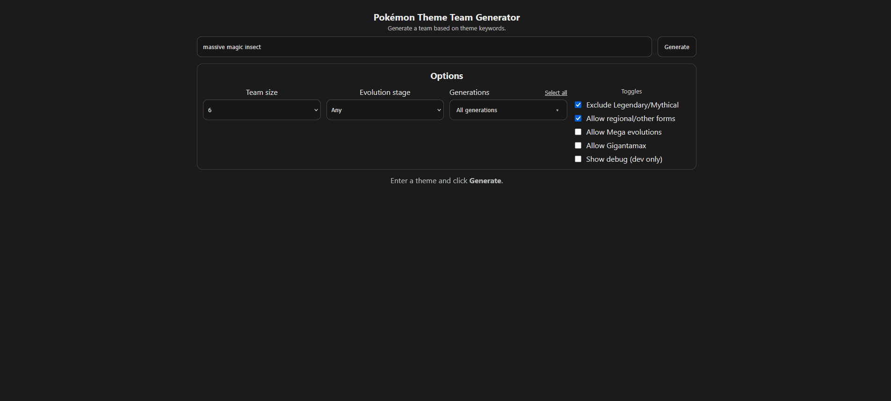
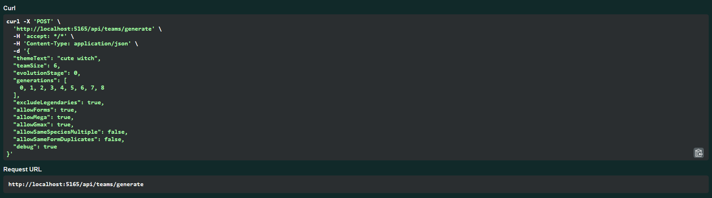
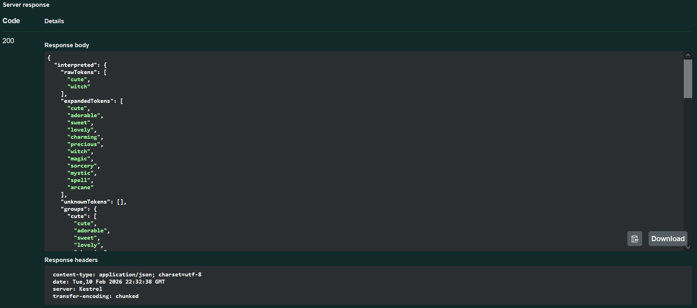
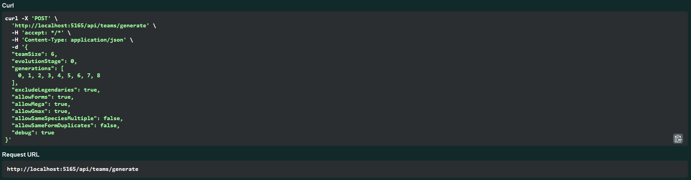
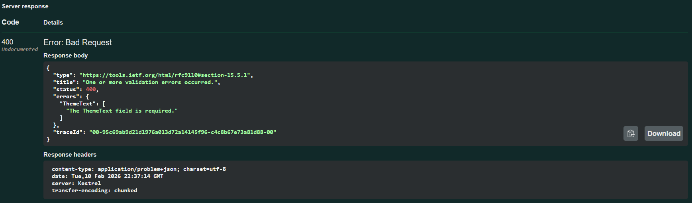
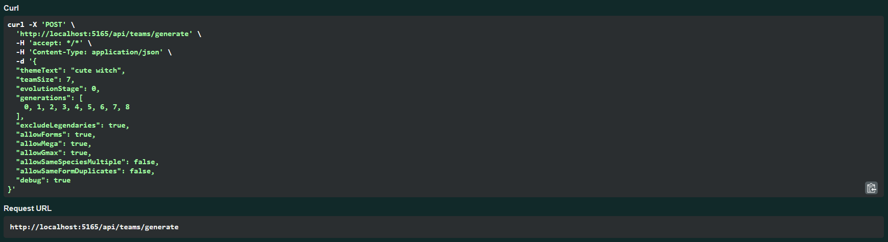
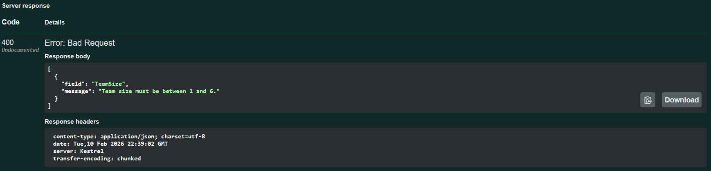
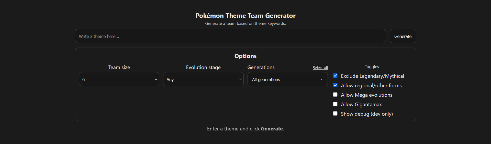
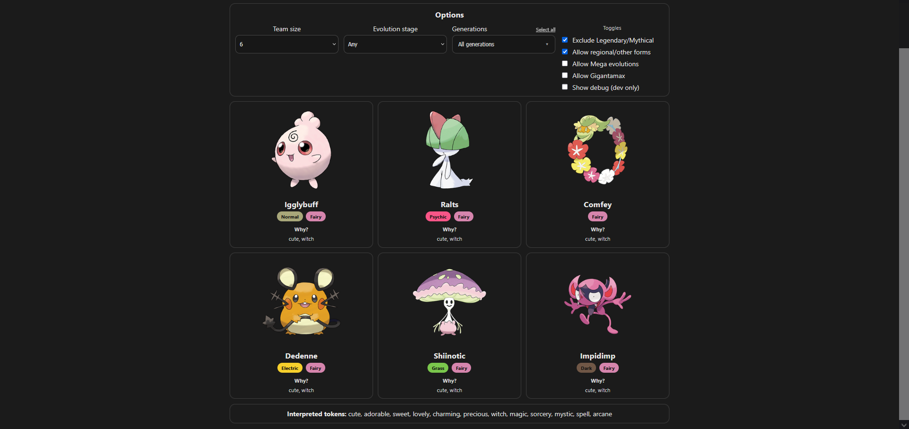
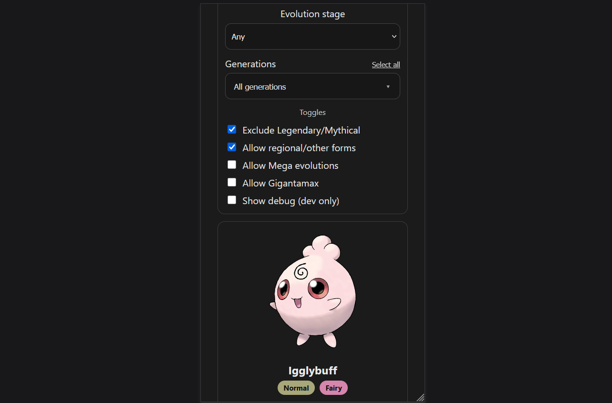

# Pokémon Theme Team Generator

A full-stack web application that generates themed Pokémon teams based on natural-language user input and configurable filters.  
Built with an ASP.NET Core Web API backend and a modern React + TypeScript (Vite) frontend.

The project focuses on **intelligent theme interpretation, data enrichment, and balanced scoring**, rather than simple keyword filtering.

---

## Project Summary

Users enter a theme such as **“cute witch”**, **“moon cat”**, or **“massive magic insect”**, and the application generates a Pokémon team that matches the theme using:

- Synonym expansion  
- Curated tags  
- Data-derived metadata  
- Balanced multi-theme scoring  
- User-configurable filters (generation, evolution stage, forms, etc.)

The backend interprets the theme, enriches it with synonyms and curated rules, and returns a diverse, explainable team along with reasoning for each Pokémon selection.



---

## Architecture Overview

### Backend
- ASP.NET Core Web API
- Service-oriented architecture with CQRS-inspired separation of concerns
- Strongly-typed API models and enums
- Local JSON dataset with enrichment and curation rule engines
- Deterministic keyword interpretation and scoring logic
- Unit tests (xUnit)

### Frontend
- React + TypeScript SPA (Vite)
- Defensive UI rendering and validation
- Responsive layout (desktop-optimised, mobile functional)
- Dev-only debug panels
- Strong typing across API boundaries

---

## Theme Interpretation & Data Enrichment

A key focus of this project is **intelligent theme matching**, not simple string comparison.

Features include:

- Large locally generated Pokémon dataset (from PokeAPI)
- Derived tags:
  - Type, generation, evolution stage  
  - Habitat, colour, shape, genus, egg groups  
- Curated tag overrides for thematic accuracy  
- Synonym expansion with filtering to avoid irrelevant matches  
- Enrichment and curation rules for thematic grouping  
- Balanced multi-theme scoring (each theme weighted equally)

Example searches that return diverse but accurate teams:

- *“evil bird”*
- *“cute witch”*
- *“moon cat”*
- *“massive magic insect”*
- *“haunted fairy doll”*
- *“light frost monster”*

---

## Features

### User Interface
- Natural language theme input  
- Team size selector  
- Generation filters  
- Evolution stage filters  
- Toggles for legendary, forms, mega, Gmax  
- Explainable “Why?” reasoning per Pokémon  
- Responsive layout  

### Backend
- Validation and defensive programming  
- Balanced multi-theme scoring  
- JSON-based rule engines  
- Unit-tested business logic  
- Deterministic keyword interpretation  

### Frontend
- Strong typing with TypeScript  
- Defensive rendering and error handling  
- Environment-based debug tools  
- Modern React hooks and patterns  

---

## API Examples

### Successful Team Generation



### Validation Error Example





---

## Screenshots

### Main UI


### Generated Team


### Responsive UI


---

## Skills & Technologies Demonstrated

- ASP.NET Core Web API  
- C# strong typing and enums  
- React + TypeScript  
- JSON data pipelines and rule engines  
- Search and scoring algorithms  
- Unit testing (xUnit)  
- Defensive programming and validation  
- Full-stack integration  
- Responsive UI design  
- Data modelling and enrichment pipelines  

---

## AI-Assisted Development

AI tools (GitHub Copilot and GPT) were selectively used for:

- Boilerplate generation  
- Refactoring suggestions  
- Exploring architectural options  

All core logic, scoring design, rule systems, and final structure were manually reviewed and refined.  
The project intentionally balances AI assistance with human decision-making and code ownership.

---

## Running Locally

### Prerequisites
- .NET SDK  
- Node.js 18+  

---

### Setup

```
git clone https://github.com/yourusername/pokemon-theme-team-generator.git
cd ...\pokemon-theme-team-generator
```

---

### Backend

```
cd backend/PokemonThemeTeam.Api
dotnet restore
dotnet run
```

---

### Frontend

```
cd frontend
npm install
npm run dev
```

Open: `http://localhost:5173`

---

## Regenerating Data (Optional)

The repository includes **pre-generated JSON datasets** so the app runs immediately.  
However, the data can be rebuilt using the included Node scripts.

These scripts are optional and only required if you want to:

- Refresh Pokémon data  
- Expand synonyms  
- Modify enrichment or curation rules  
- Experiment with dataset generation  

### Install Node Dependencies (Backend Tools)

```
cd backend/PokemonThemeTeam.Api
npm install
```

### Rebuild Pokémon Dataset

```
node tools/build-dataset.mjs
```

This script:
- Pulls data from PokeAPI
- Applies enrichment rules
- Applies curation rules
- Generates `pokemon.json`

### Rebuild Synonyms

```
node tools/build-synonyms.mjs
```

This script:
- Expands base synonyms
- Applies filters
- Generates `synonyms.generated.json`

> **Note:** The generated files are already committed for convenience.  
> These scripts exist for transparency and reproducibility.

---

## Notes

- Desktop-optimised, mobile functional.  
- Large JSON datasets may increase initial load time slightly.  
- Pokémon assets are for demonstration only.  

---

## Disclaimer

Pokémon and related assets are © Nintendo, Game Freak, and The Pokémon Company.  
This project is for educational and portfolio purposes only and is not affiliated with or endorsed by them.
